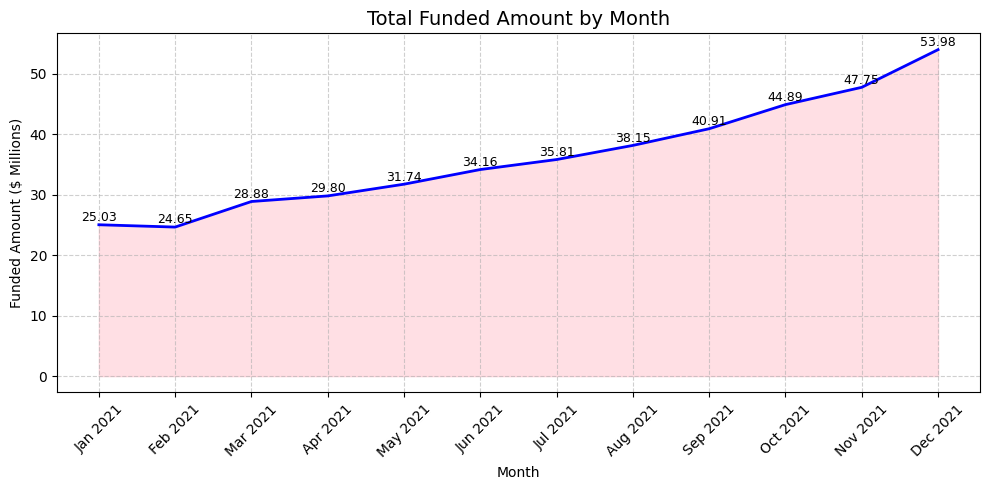
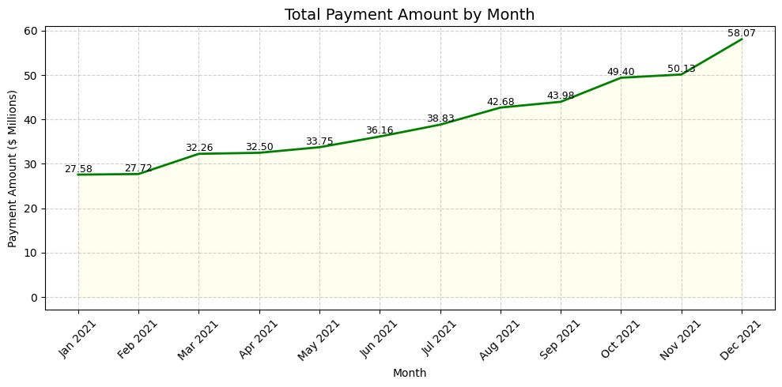
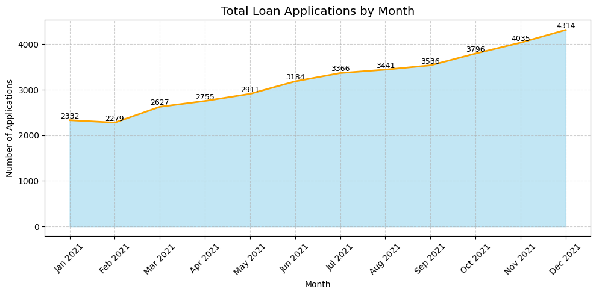
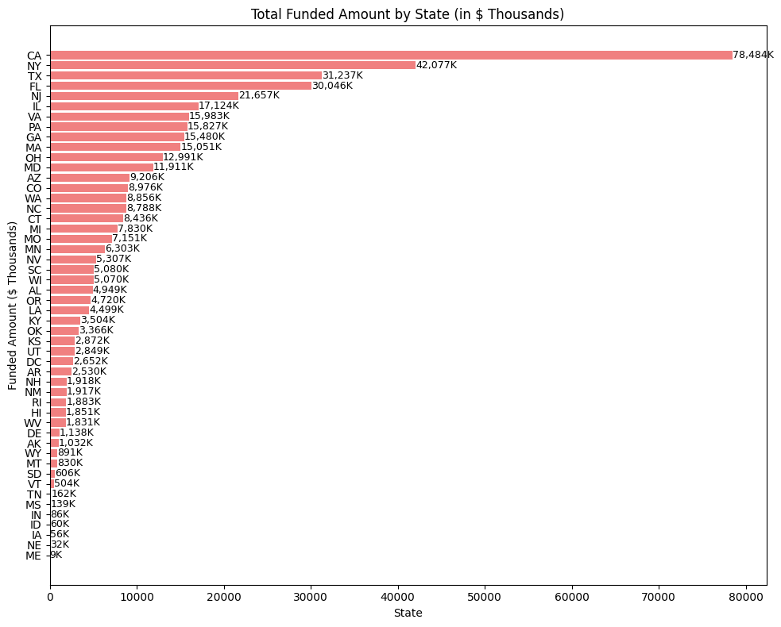
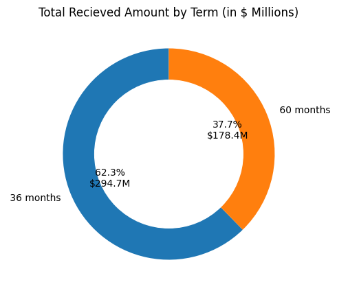
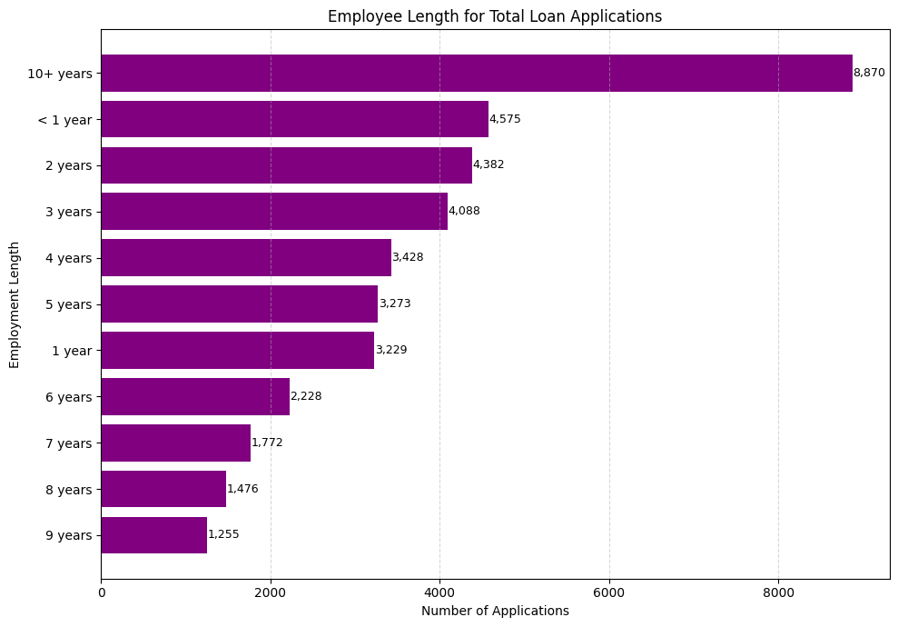
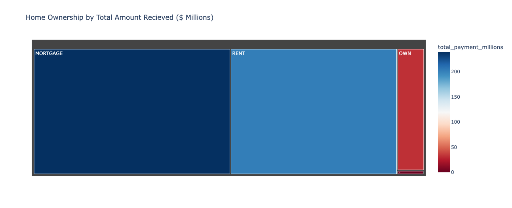
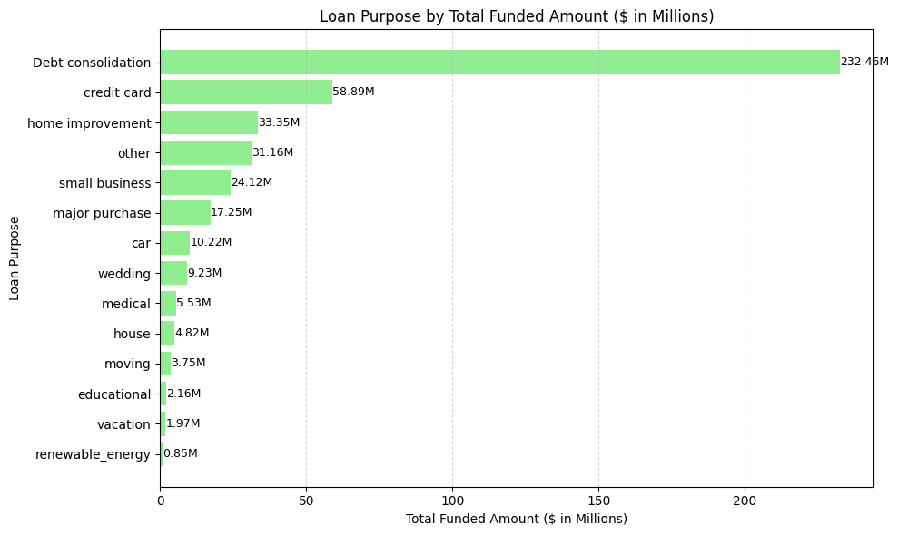

# Bank Loan Analysis Report

## Goal

Create a comprehensive Bank Loan Report to monitor and assess lending activities. The report provides data-driven insights into portfolio health, identifies trends, and enables strategic decision-making. This analysis covers three dashboard areas: Summary (KPIs), Overview (Charts), and Details.

---

## Problem Statement

**Objective:** Track and analyze 38,576 bank loans to understand portfolio performance, identify lending trends, and assess loan quality through systematic analysis of key performance indicators, geographic patterns, and customer segments.

---

## Data

- **Size**: 38,576 loans across 50 US states
- **Period**: Full year 2021 (Jan 1 - Dec 12)
- **Source**: financial_loan_data_excel.xlsx
- **Tracking**: Month-to-Date (MTD) and Month-over-Month (MoM) metrics

---

## KPI Requirements

### Core Metrics
- **Total Loan Applications**: 38,576 (with MTD & MoM tracking)
- **Total Funded Amount**: $435.8M (with MTD & MoM tracking)
- **Total Amount Received**: $473.1M (with MTD & MoM tracking)
- **Average Interest Rate**: 12.05%
- **Average DTI**: 13.3%

### Good Loan vs Bad Loan KPIs
| Metric | Good Loans | Bad Loans |
|--------|-----------|-----------|
| Applications | 33,243 (86.2%) | 5,333 (13.8%) |
| Funded Amount | $380.0M+ | $55.0M+ |
| Total Received | $415.0M+ | $58.0M+ |
| Status | Fully Paid + Current | Charged Off |

---

## Key Outputs

### 1. Portfolio Health
- **86.2%** of loans are performing (Fully Paid or Current)
- **13.8%** defaulted (Charged Off)
- **Total Funded**: $435.8M | **Total Collected**: $473.1M (108% recovery)
- **Average Interest Rate**: 12.05%
- **Insight**: Portfolio is mostly healthy but needs risk monitoring

### 2. Debt Consolidation Dominates
- **47.1%** of all loans are for debt consolidation (18,214 loans)
- Credit card payoff is second at 13%
- **Average Loan Size**: $11,296 | **Average DTI**: 13.3%
- **Insight**: Consolidation is the main product people want to reduce existing debt

### 3. Monthly Trends Are Steady
- Funding, collections, and applications stay consistent each month
- No major seasonal spikes
- **Loan Terms**: 73% are 36-month, 27% are 60-month
- **Insight**: Predictable business good for forecasting

### 4. Geographic Concentration
- States vary widely in lending volume
- Some states drive significantly more business
- **Insight**: Opportunity to expand in underperforming regions

### 5. Employment Stability Matters
- People with longer job history get more loans
- 23% of borrowers have 10+ years employment (most stable segment)
- **Insight**: Job stability correlates with loan approval/demand

### 6. Home Ownership Affects Repayment
- Homeowners vs. renters show different repayment patterns
- **Loan Grade Distribution**: B-grade dominates (30% of portfolio)
- **Insight**: Home ownership could be a risk factor in underwriting

---

## Dashboards

### Dashboard 1: Summary (KPIs)
- Portfolio health metrics (Good vs Bad loans)
- Performance tracking (MTD, MoM trends)
- Loan Status Grid View by status category

### Dashboard 2: Overview (Charts)
Visualizations showing trends and distribution:

1. Monthly Trends by Issue Date
   

2. Monthly Collections Trend
   

3. Monthly Applications Trend
   

4. Regional Analysis by State
   

5. Loan Term Analysis
   

6. Employee Length Analysis
   

7. Home Ownership Analysis
   

8. Total Funded Amount (Summary)
   

### Dashboard 3: Details
Comprehensive details dashboard with consolidated loan data view

---

## How to Run

```bash
# Install dependencies
pip install -r requirements.txt

# Run analysis (Jupyter - recommended)
jupyter notebook Bank_Loan_Analysis.ipynb

# Or run Python script
python bank_loan_analysis.py
```

---

## Tech Stack

- Pandas (data wrangling)
- Matplotlib & Seaborn (charts)
- Plotly (interactive visualizations)
- Jupyter Notebook / Python

---

## Quick Stats

| Metric | Value |
|--------|-------|
| Total Funded | $435.8M |
| Total Collected | $473.1M |
| Loan Performance | 86.2% good, 13.8% default |
| Avg Interest Rate | 12.05% |
| Avg Loan Amount | $11,296 |
| Avg DTI | 13.3% |
| Avg Annual Income | $69,645 |
| Consolidation Loans | 47.1% of portfolio |
| 36-Month Terms | 73% | 60-Month Terms | 27% |
| Most Stable Borrowers | 23% have 10+ years employment |
| Top Loan Grade | B-grade (30% of portfolio) |

---

## Files

- `Bank_Loan_Analysis.ipynb` - Full analysis with code and visualizations
- `bank_loan_analysis.py` - Python script version
- `financial_loan_data_excel.xlsx` - Data file

---

## Google Colab

[Open in Google Colab](https://colab.research.google.com/drive/1TegQqE_QVqAdqqRulCtQ1DLoibpI202O?usp=sharing)